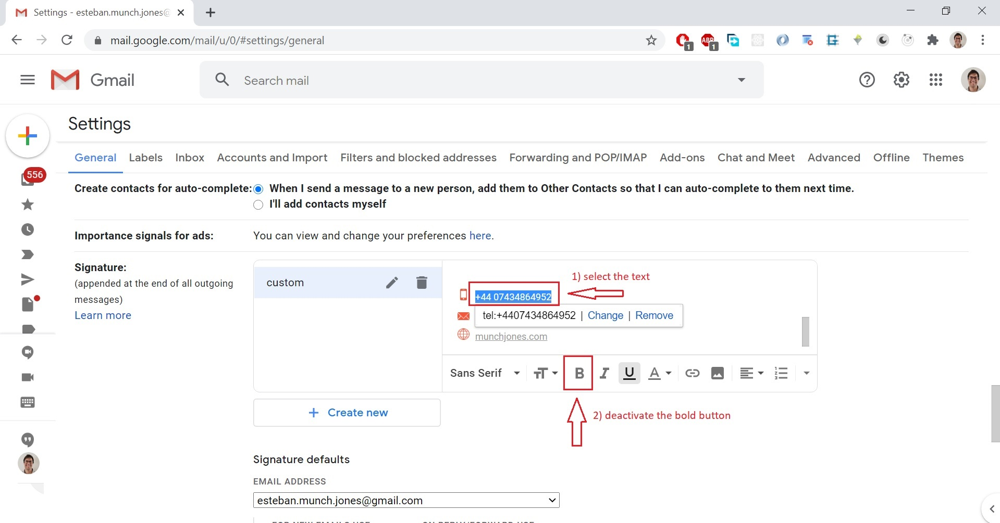

# Build your custom email signature with HTML and CSS 

There are plenty of online email signature generators out there, but none of the free ones convinced me. Some of them had nice layouts, but the icons had low quality and were blurry. 

So..., I decided to build my own email signature, and style it my own way, to truly represent me. Here is the final product, that has **social media icons, phone number, email and website that can be clicked and redirect people to links!!**


 In this article, I'm gonna share with you the creation process, step by step:

Table of contents:  

- [Getting the icons](#getting-the-icons)

- [Styling the icons](#styling-the-icons)

- [Hosting the icons](#hosting-the-icons)

- [Writing the HTML and CSS code](#writing-the-HTML-and-CSS-code)

- [Adding the signature to the email provider](#Adding-the-signature-to-the-email-provider)

You can do the same and **show the world your coding skills from a simple email signature**. **Let's get onboard and start this coding adventure!**

## Getting the icons

The first thing is to find good free quality icons, and the best place is https://uxwing.com/, because they don't require you to add attributions in your code when using them.

In this example, I'll just add three social media icons: [Twitter](https://uxwing.com/twitter-round-icon/), [LinledIn](https://uxwing.com/linkedin-round-icon/) and [GitHub](https://uxwing.com/github-icon/). So, it's a matter of searching for them in the page provided and download the PNG format.


Then, download [mobile](https://uxwing.com/mobile-icon/), [envelope](https://uxwing.com/envelope-icon/) and [globe](https://uxwing.com/world-globe-line-icon/) icons.

## Styling the icons

All these icons have transparent background and are black. This color might meet your needs, but chances are you want to use a custom color. In order to change it, let's use a super nice online tool: 

[Onlinepngtools - change color](https://onlinepngtools.com/change-png-color#:~:text=World's%20simplest%20online%20Portable%20Network,new%20colors%20on%20the%20right.). You can upload your `.png` file and change the color. Here, I've changed the default `black` for `#f5593d`.


Feel free to experiment with your own colors; there are loads of websites to help you select the best ones.

Let's repeat this step of changing colors for all the downloaded icons.

The original sizes of the icons are quite big and in this article and as we plan to use them in small sizes, let's reduce its size with [Onlinepngtools - resize png](https://onlinepngtools.com/resize-png). I've chosen the new width to be 100px and keep the aspect ratio. To change the size, just add the new width value like this:


## Hosting the icons

Images used in HTML must be hosted somewhere. To do this, I've decided to use Firebase, because it's got a great CDN, so the assets (in this case, the icons) will be delivered super fast.

Go to your [Firebase console](https://console.firebase.google.com/) and create a project and click on add a project:


Then, just follow the 3 steps required to create the project. Once it has been created, we want to use the `storage` option from the left menu:


Then just follow the 2 steps required without changing any default config, unless you know what you're doing.

Once the storage bucket has been successfully created, you'll be able to upload your first icon by click on `upload file`:


You can upload all the icons at once by selecting multiple ones, so you don't need to upload each file separately. 

Once the icons were uploaded, just get the `image address` of each one by following these steps:


If you paste the address on your browser, you should see this:


It means that the styled icon is now available for the entire world!


## Writing the HTML and CSS code

Now is the time to express all your creativity. 

This is my personal approach to styling: I've chose a simple signature, with just 2 colors (apart from the white background). 

The color palette for this project is: 

- background: `white`
- icons and small details: `#f5593d`
- Letters: `#9a9a9a`

Bear in mind that sometimes, less is more, so you don't wanna bloat your signature with loads of colors, images, and all crammed.

I've created one html file with this content:

```
<table cellpadding="0" cellspacing="0"  style="vertical-align: -webkit-baseline-middle; font-size: medium; font-family: Arial;">
    <tbody>
        <tr>
            <td>
                <table cellpadding="0" cellspacing="0"  style="vertical-align: -webkit-baseline-middle; font-size: medium; font-family: Arial;">
                    <tbody>
                        <tr>
                            <td style="vertical-align: top;">
                                <table cellpadding="0" cellspacing="0"  style="vertical-align: -webkit-baseline-middle; font-size: medium; font-family: Arial;">
                                    <tbody>
                                        
                                    </tbody>
                                </table>
                            </td>
                            <td width="46">
                                <div></div>
                            </td>
                            <td style="padding: 0px; vertical-align: middle;">
                                <h3 color="#9a9a9a"  style="margin: 0px; font-size: 18px; color: rgb(154, 154, 154);">
                                    <span>Esteban Munch Jones</span>
                                </h3>
                                <p color="#9a9a9a" font-size="medium" style="margin: 0px; color: rgb(154, 154, 154); font-size: 14px; line-height: 22px;">
                                    <span>Front End Engineer</span>
                                </p>
                                <table cellpadding="0" cellspacing="0"  style="vertical-align: -webkit-baseline-middle; font-size: medium; font-family: Arial; width: 100%;">
                                    <tbody>
                                        <tr>
                                            <td height="20"></td>
                                        </tr>
                                        <tr>
                                            <td>
                                                <table cellpadding="0" cellspacing="0"  style="vertical-align: -webkit-baseline-middle; font-size: medium; font-family: Arial; display: inline-block;">
                                                    <tbody>
                                                        <tr style="text-align: center;">
                                                            <td width="5">
                                                                <div style="margin-left: 0px; margin-right: 5px;">
                                                                    <a href="https://www.linkedin.com/in/estebanmunchjones/" target="_blank">
                                                                         
                                                                    </a>
                                                                </div>
                                                            </td>
                                                            <td width="5">
                                                                <div style="margin-left: 0px; margin-right: 5px;">
                                                                    <a href="https://twitter.com/MunchEsteban" target="_blank">
                                                                         
                                                                    </a>
                                                                </div>
                                                            </td>
                                                            <td width="5">
                                                                <div style="margin-left: 0px; margin-right: 5px;">
                                                                    <a href="https://github.com/estebanmunchjones2019" target="_blank">
                                                                         
                                                                    </a>
                                                                </div>
                                                            </td>
                                                        </tr>
                                                    </tbody>
                                                </table>
                                            </td>
                                        </tr> 
                                        <tr>
                                            <td height="5px"></td>
                                        </tr>
                                        <tr>
                                            <td color="#f5593D" direction="horizontal" height="1" style="width: 100%; border-bottom: 1px solid rgb(245, 89, 61); border-left: none; display: block;"></td>
                                        </tr>
                                        <tr>
                                            <td height="30px"></td>
                                        </tr>
                                    </tbody>
                                </table>
                                <table cellpadding="0" cellspacing="0"  style="vertical-align: -webkit-baseline-middle; font-size: medium; font-family: Arial;">
                                    <tbody>
                                        <tr height="25" style="vertical-align: middle;">
                                            <td style="width: 30; vertical-align: middle;" >
                                                <table cellpadding="0" cellspacing="0"  style="margin: 0 auto; vertical-align: -webkit-baseline-middle; font-size: medium; font-family: Arial;">
                                                    <tbody>
                                                        <tr>
                                                            <td style="vertical-align: bottom;">
                                                                <span width="30" style="display: block;">
                                                                    
                                                                </span>
                                                            </td>
                                                        </tr>
                                                    </tbody>
                                                </table>
                                            </td>
                                            <td style="padding: 0px; color: rgb(154, 154, 154);">
                                                <a href="tel:+44 07434864952" color="#9a9a9a" style="text-decoration: none; color: rgb(154, 154, 154); font-size: 12px;">
                                                    <span>+44 07434864952</span>
                                                </a>
                                            </td>
                                        </tr>
                                        <tr height="25" style="vertical-align: middle;">
                                            <td  width="30" style="vertical-align: middle;">
                                                <table cellpadding="0" cellspacing="0"  style="margin: 0 auto; vertical-align: -webkit-baseline-middle; font-size: medium; font-family: Arial;">
                                                    <tbody>
                                                        <tr>
                                                            <td style="vertical-align: bottom;">
                                                                <span width="30" style="display: block;">
                                                                    
                                                                </span>
                                                            </td>
                                                        </tr>
                                                    </tbody>
                                                </table>
                                            </td>
                                            <td style="padding: 0px;">
                                                <a href="mailto:hi@munchjones.com" color="#9a9a9a" style="text-decoration: none; color: rgb(154, 154, 154); font-size: 12px;">
                                                    <span>hi@munchjones.com</span>
                                                </a>
                                            </td>
                                        </tr>
                                        <tr height="25" style="vertical-align: middle;">
                                            <td width="30" style="vertical-align: middle;">
                                                <table cellpadding="0" cellspacing="0"  style="margin: 0 auto; vertical-align: -webkit-baseline-middle; font-size: medium; font-family: Arial;">
                                                    <tbody>
                                                        <tr>
                                                            <td style="vertical-align: bottom;">
                                                                <span width="30" style="display: block;">
                                                                    
                                                                </span>
                                                            </td>
                                                            </tr>
                                                        </tbody>
                                                    </table>
                                                </td>
                                                <td style="padding: 0px;"><a href="https://munchjones.com" color="#9a9a9a" style="text-decoration: none; color: rgb(154, 154, 154); font-size: 12px;">
                                                    <span>munchjones.com</span>
                                                </a>
                                            </td>
                                        </tr>
                                    </tbody>
                                </table>
                                <table cellpadding="0" cellspacing="0"  style="vertical-align: -webkit-baseline-middle; font-size: medium; font-family: Arial;">
                                    <tbody>
                                        <tr>
                                            <td height="30"></td>
                                        </tr>
                                    </tbody>
                                </table>
                            </td>
                        </tr>
                    </tbody>
                </table>
            </td>
        </tr>
    </tbody>
</table>
```


The code can be scary at first, but it's just a combination of `<table>`, `<tbody>`, `<tr>` and `<td>`. If you have never worked with these html tags, take a look at this [resource](https://www.w3schools.com/html/html_tables.asp).

If you wanna get really solid with CSS, the best way is to do this course by Academind: [CSS: The Complete Guide 2020 - including Flexbox grid & Sass](https://pro.academind.com/p/css-the-complete-guide-2020-incl-flexbox-grid-sass)

In this case, the CSS code is written inside `<style>` tags to avoid creating a `.css` file to write the styling rules there. The inline approach, which is called _inline styling_, is very suitable for small code snippets like this one.

Make sure you replace the data with your personal one, and don't forget to replace the `href` links of Twitter, LinkedIn, GitHub, phone, email and website. If you haven't noticed it yet, these 3 icons are clickable, so when people get your email signature, they'll be able to go to your profiles. And when they click on the phone, email and website paragraphs they're gonna be redirected. Pretty neat, isn't it?

You can create a `.html` file with the name of your choice, and paste the code inside.

Then, to actually see the code rendered in the browser, you need to copy the file path:


Then, go to your favorite browser an paste the address in the navigation bar and press enter:


## Adding the signature to the email provider

To wrap this project up, let's add this signature to an email provider. In my case, **I use Gmail**, and the following step may vary depending on your provider.

1) Copy the signature by keeping the left click pressed and hover over the content and copy it:


2) Then, go to your Gmail account and click on `see all settings`:

 

3) Now, create a new signature:


4) You'll be prompted with a form to fill the name of your signature, so put the name you want.

5) After that, you should paste your copied signature in the text box. 


6) Let's make a tiny adjustment on the phone number, email and website, by deactivating the bold option, if they got bold when you pasted them:



Repeat the step above for the email and website.

6) Now, just add your new signature to `new mails` and `replies` (or the options you prefer):

7) And finally save the changes:


Let's test it now:


**Wow!! a modern, good looking and functional signature, thanks to HTML and CSS.**

